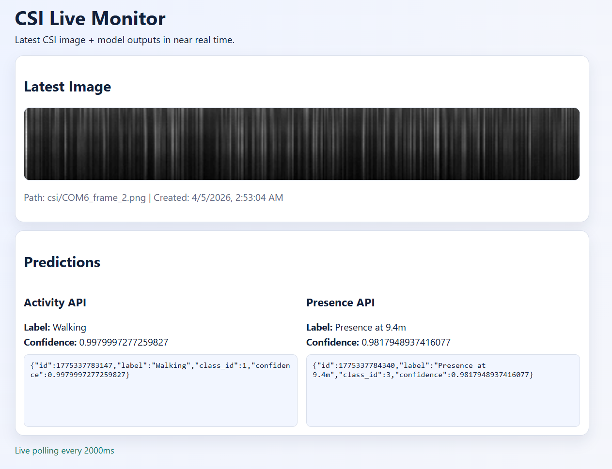

# CSI Live Monitor

End-to-end CSI monitoring pipeline with:

- a Python sender script for CSI collection + model calls
- Supabase for storage and latest prediction state
- a static website for live visualization

## Website Preview



## How The System Works

1. `import.py` runs on the machine connected to ESP/serial.
2. It reads CSI packets and builds a `400 x 52` matrix.
3. The matrix is saved as a PNG image.
4. The image is uploaded to Supabase Storage bucket `csi-images`.
5. The same image is sent to both model endpoints:
	- activity model
	- presence model
6. The model responses are stored in `csi_predictions` table.
7. The website (`index.html` + `app.js`) polls Supabase every `POLL_MS` and shows:
	- latest image
	- label + confidence for each model
	- full raw JSON response for each model

## Project Files

- [import.py](import.py): Sender script (serial -> image -> upload -> models -> DB row)
- [python/uploader.py](python/uploader.py): Shared helper functions for upload/API/table writes
- [index.html](index.html): Main static website page
- [app.js](app.js): Website data fetching and rendering logic
- [styles.css](styles.css): Website styling
- [config.example.js](config.example.js): Website config template
- [config.js](config.js): Website runtime config
- [supabase_setup.sql](supabase_setup.sql): SQL for table and RLS policies
- [.env.example](.env.example): Sender machine environment template

## Supabase Setup

### 1) Create Storage Bucket

Create a public bucket named `csi-images`.

### 2) Create Database Table and RLS

Run [supabase_setup.sql](supabase_setup.sql) in Supabase SQL Editor.

### 3) Storage Policies (Upload + Read)

Run this in SQL Editor:

```sql
drop policy if exists "storage_read_anon" on storage.objects;
drop policy if exists "storage_insert_anon" on storage.objects;

create policy "storage_read_anon"
on storage.objects
for select
to anon
using (bucket_id = 'csi-images');

create policy "storage_insert_anon"
on storage.objects
for insert
to anon
with check (bucket_id = 'csi-images');
```

If you get `policy already exists`, run the `drop policy if exists ...` lines first, then run create again.

## Sender Machine Setup (Python)

This setup is only for the CSI sender machine.

1. Copy [.env.example](.env.example) to `.env`
2. Fill real values for:
	- `SUPABASE_URL`
	- `SUPABASE_ANON_KEY`
	- `ACTIVITY_API_URL`
	- `PRESENCE_API_URL`
	- serial settings (`ESP_PORTS`, `BAUD_RATE`)
3. Install dependencies and run:

```powershell
python -m venv .venv
.\.venv\Scripts\Activate.ps1
pip install -r requirements.txt
python .\import.py
```

## Website Setup

The website is static and does not require Python in production.

1. Copy [config.example.js](config.example.js) to [config.js](config.js)
2. Set:
	- `SUPABASE_URL`
	- `SUPABASE_ANON_KEY`
	- `BUCKET_NAME`
	- `TABLE_NAME`
	- `POLL_MS`

## Local Website Test

From repository root:

```powershell
python -m http.server 5500
```

Open `http://localhost:5500`.

## Deploy Website Online

Because `index.html` is in repository root, deploy from root.

### GitHub Pages

1. Repository Settings -> Pages
2. Source: `Deploy from a branch`
3. Branch: `main`
4. Folder: `/ (root)`

### Netlify

1. Import repo in Netlify
2. Build command: none
3. Publish directory: `.`

### Vercel

1. Import repo in Vercel
2. Framework preset: `Other`
3. Output directory: `.` (or leave default for static root)

## Runtime Responsibilities

- Sender machine runs [import.py](import.py)
- Supabase stores images + prediction rows
- Website host serves static files only

## Troubleshooting

- Website not updating after manual image upload:
  Uploading to bucket alone is not enough. A row must also be inserted in `csi_predictions` with matching `image_path`.
- `Missing config.js` in browser:
  Ensure [config.js](config.js) exists and has real values.
- Python import errors:
  Install dependencies from [requirements.txt](requirements.txt).

## Security Note

If keys were shared publicly during testing, rotate them in Supabase and update `.env` and `config.js`.
